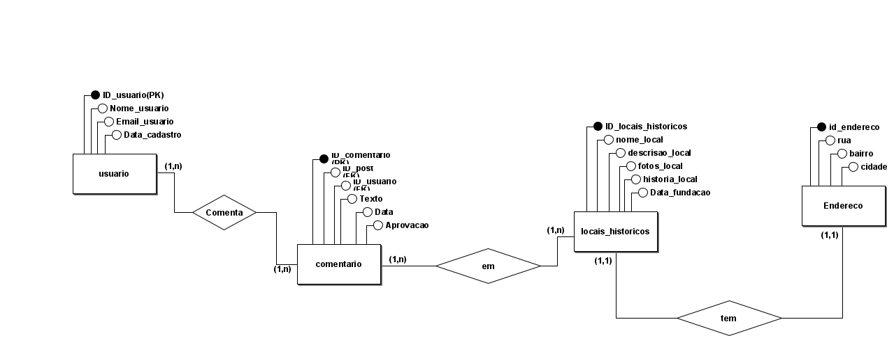

<h1>Memória São Leopoldo</h1>

O projeto consiste em um site interativo que compara fotos e histórias antigas de São Leopoldo com imagens e informações atuais dos mesmos locais. O objetivo é preservar a memória da cidade e permitir que os usuários compartilhem curiosidades e relatos pessoais sobre esses lugares. Além de ser um espaço de nostalgia e descoberta, o site promove a valorização do patrimônio cultural e urbano da cidade.

